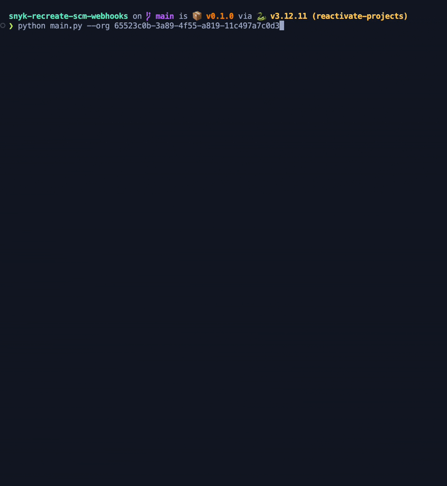

# Snyk - Reacreate SCM Webhooks

To recreated a missing webhook for a repo, we just need to deactivate and reactivate one project inside that repo.

What this tool does:

1. Get projects for the selected Org.
2. Select one project for each target (repo).
3. Save all targets with project to a file (`targets_to_reactivate.json`).
4. Load the file containing the targets to reactivate.
5. For each target/project, deactivate and reactivate.

After this process, it will generate the following files:

- `reactivated_projects.json`: all the successfuly reactivated projects
- `failed_projects_reactivation.json`: all the failed reactivation projects
- `app.log`: the process logs file





## Setup

Requirements:
- Python 3.12
- UV
- SNYK_TOKEN env variable to authenticate with Snyk ORG.

Prepare Dev:
- Run `uv sync`
- Activate venv `source .venv/bin/activate`

DotEnv: create a `.env` file with:

```
SNYK_TOKEN="token f19c24d8-******-8ea57a21da09"
```

## Running

```
usage: main.py [-h] --org ORG --project-ids [PROJECT_IDS ...] [--origins [ORIGINS ...]] [--load-only] [--reactivate-only] [--include-cli-origin] [--retry-failed]
               [--api-version API_VERSION] [--threads THREADS]
```

### Options

#### `--org`
The Organization ID. e.g. `--org 65523c0b-3a89-4f55-a819-11c497a7c0d3`


#### `--project-ids [PROJECT_IDS ...]` (optional)
You can specify which projects should be reactivated using this option. e.g `--project-ids b126bdb2-752a-43e2-83a0-9960212a0096 09a7941d-69d1-4809-a252-514a7657c66e`


#### `--origins [ORIGINS ...]` (optional)
By default, the tool reactivate one project for each target, all targets in all origins (except created from CLI).

To restrict the origins the tool should fetch projects, use this option. e.g. `--origins github bitbucket`


#### `--load-only` (optional)
By default, the tool will fetch projects first, then save the projects that need to be reactivated in `projects_to_reactivate.json` file.
After this, it will read this file and reactivate each project.

To only fetch the projects and not reactivate them, use this option. e.g. `--load-only`


#### `--reactivate-only` (optional)
By default, the tool will fetch projects first, then save the projects that need to be reactivated in `projects_to_reactivate.json` file.
After this, it will read this file and reactivate each project.

To not fetch the projects and only reactivate the projects, use this option. e.g. `--reactivate-only`


#### `--include-cli-origin` (optional)
By default, the tool not include projects created from `CLI`. To include them, use this option. e.g. `--include-cli-origin`


#### `--retry-failed` (optional)
After reactivate the projects, two files will be created:

- `reactivated_projects.json`: has all the successfuly reactivated projects
- `failed_projects_reactivation.json`: has all the failed reactivation projects

If you want to retry the failed projects, use this option. e.g. `--retry-failed`


#### `--api-version` (optional)
Use this option to configure which api version to use. e.g. `--api-version 2024-10-15`


#### `--threads` (optional)
You can configure the number of threads for reactivation process. e.g. `--threads 5`


## Example:

```sh
export SNYK_TOKEN="token f19c*********21da09"
python main.py --org 65523c0b-3a89-4f55-a819-11c497a7c0d3
```


## Run with Docker

This project contains a Dockerfile to not depend on python or uv install.

Note: include the `-it` to see progress bar and other colored elements.

```sh
SNYK_TOKEN="token f19c********a09"
ORG_ID="65523c0b-3a89-4f55-a819-11c497a7c0d3"

docker build -t snyk-recreate-scm-webhooks .
docker run --rm -e SNYK_TOKEN="$SNYK_TOKEN" -it snyk-recreate-scm-webhooks --org $ORG_ID
```